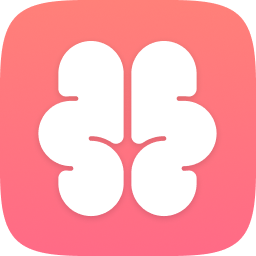

#  rem

🧠 Remember everything. (very alpha)

### Original Demo

An open source approach to locally record everything you view on your Apple Silicon computer.

_Note: Only tested on Apple Silicon, and the release is Apple Silicon._

---

Please log any bugs / issues you find!

Working on getting an Apple Development account for official distribution...

---

I think the idea of recording everything you see has the potential to change how we interact 
with our computers, and believe it should be open source.

Also, from a privacy / security perspective, this is like... pretty scary stuff, and I want the code open 
so we know for certain that nothing is leaving your laptop. Even logging to Sentry has the potential to 
leak private info.

This is 100% local. Please, read the code yourself.

### This is crazy alpha version
I wrote this in a couple days over the holidays, and if there's one takeaway, it's that I'm a
complete novice at Swift.

## Build it yourself
- Open project in Xcode
- Clone `https://github.com/stephencelis/SQLite.swift` and add it to the project
- Product > Archive
- Distribute App
- Custom
- Copy App

## Getting Started
- Build it yourself
  - If you really don't want to, download release and run `xattr -c rem.app`. This tells macos "all good". I'm not malicious, but don't take my word for it.
- Launch the app
- Click the brain
- Click "Start Remembering"
- Grant it access to "Screen Recording" i.e. take screenshots every 2 seconds
- Click "Open timeline" or "Cmd + Scroll Up" to open the timeline view
    - Scroll left or right to move in time
- Click "Search" to open the search view
    - Search your history and click on a thumbnail to go there in the timeline
- In timeline, give Live Text a second and then you can select text
- Click "Copy Recent Context" to grab a prompt for interacting with an LLM with what you've seen recently as context
- Click "Purge All Data" to delete everything (useful if something breaks)

(that should be all that's needed)

## Current supports:
- Going back in time (full-screen scrubber of everything you've viewed)
- Copy text from back in time
- Search everything you've viewed
- Easily grab recent context for use with LLMs

## Things I'd love to add:
- Natural language search / agent interaction via updating local vector embedding
    - [I've also been exploring novel approaches to vector dbs](https://github.com/jasonjmcghee/portable-hnsw)
- Multi-monitor support

## Contributors ✨
Be the first!

### FAQ
- Where is my data?
    - `~/Library/Application\ Support/today.jason.rem/`

### XCode + copy / paste from history:

https://github.com/jasonjmcghee/rem/assets/1522149/97acacb9-b8c6-4b9c-b452-5423fb4e4372
